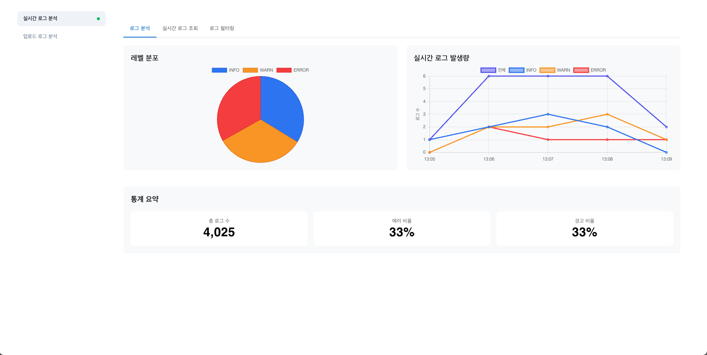
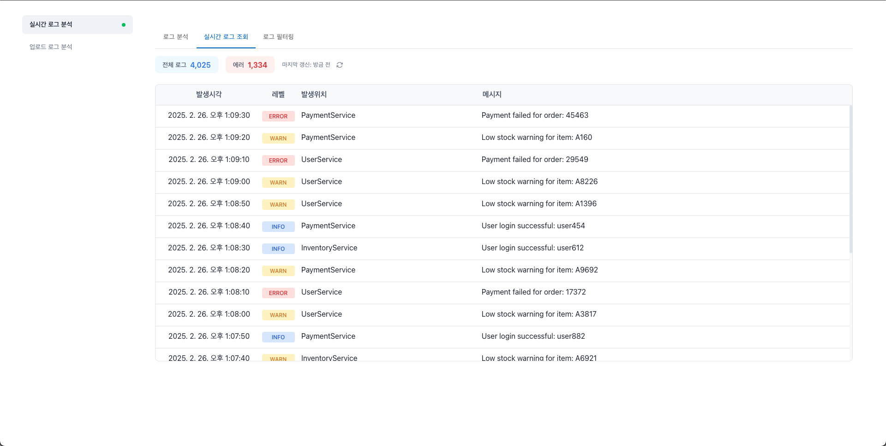
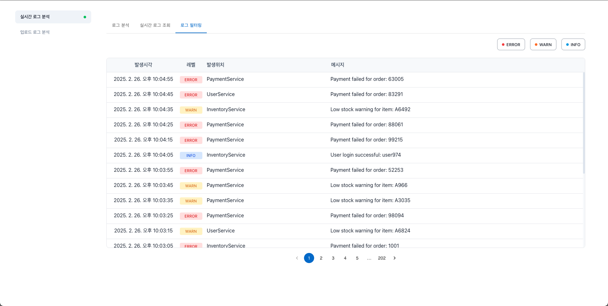
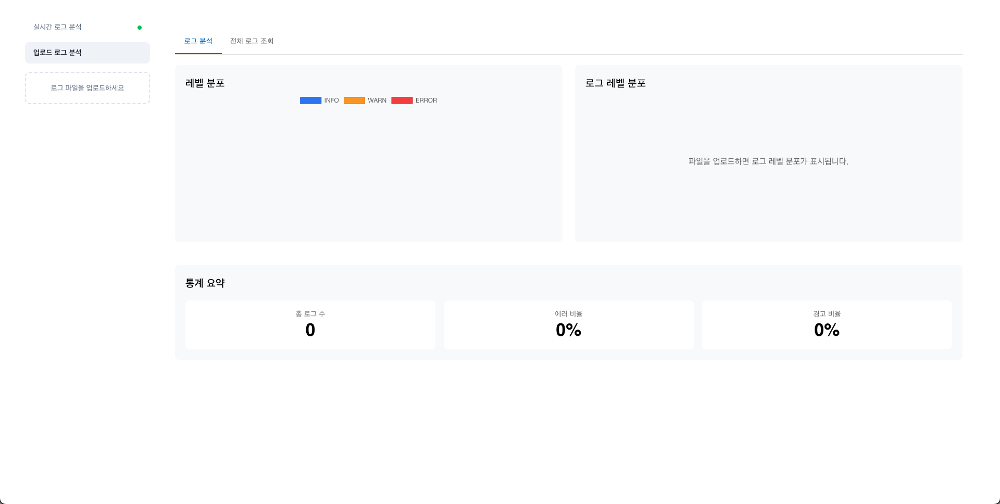
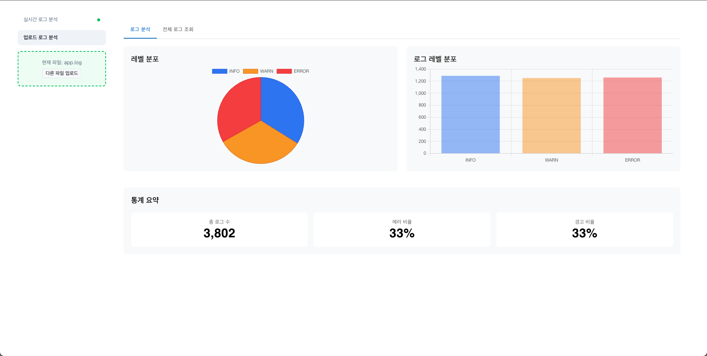
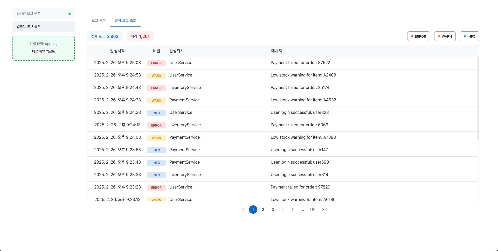

# 실시간 로그 분석 시스템

## 📑 목차

- [실시간 로그 분석 시스템](#실시간-로그-분석-시스템)
  - [📑 목차](#-목차)
  - [📋 프로젝트 개요](#-프로젝트-개요)
  - [🛠 기술 스택](#-기술-스택)
    - [클라이언트](#클라이언트)
    - [서버](#서버)
    - [공통](#공통)
  - [1. 루트 디렉터리 이동](#1-루트-디렉터리-이동)
  - [2. frontend 폴더로 이동 후 .env 파일 생성](#2-frontend-폴더로-이동-후-env-파일-생성)
  - [3. Docker Compose 실행](#3-docker-compose-실행)
  - [📌 API 문서](#-api-문서)
    - [**1. POST /logs/upload**](#1-post-logsupload)
    - [**2. GET /logs/analyze**](#2-get-logsanalyze)
    - [**3. GET /logs/errors**](#3-get-logserrors)
    - [**4. GET /logs/ws-stream**](#4-get-logsws-stream)
    - [**5. GET /logs/ws-distribution**](#5-get-logsws-distribution)
  - [💻 웹 UI 설명](#-웹-ui-설명)
    - [실시간 로그 기반 (app.log 파일 사용)](#실시간-로그-기반-applog-파일-사용)
    - [업로드 로그 기반 (사용자가 업로드한 로그 파일 사용)](#업로드-로그-기반-사용자가-업로드한-로그-파일-사용)

## 📋 프로젝트 개요

Spring Boot 기반 로그 분석 시스템과 React 대시보드를 구현하여, 로그 데이터 생성, 분석, 시각화를 수행하는 프로젝트입니다.

## 🛠 기술 스택

### 클라이언트

|                  |                                                                                                                                       |
| :--------------- | :------------------------------------------------------------------------------------------------------------------------------------ |
| Framework        |                                   |
| Language         |                        |
| Styling          |          |
| State Management |                                           |
| IDE              |  |

### 서버

|           |                                                                                                                          |
| :-------- | :----------------------------------------------------------------------------------------------------------------------- |
| Framework |           |
| Language  |                    |
| Database  |                    |
| IDE       |  |

### 공통

|                 |                                                                                                                                                                                                                         |
| :-------------- | :---------------------------------------------------------------------------------------------------------------------------------------------------------------------------------------------------------------------- |
| Version Control |                 |
| Copilot         |   |

## 🚀 실행 방법
#### 1. 루트 디렉터리 이동

```bash
cd humuson-assignment
```

### 2. frontend 폴더로 이동 후 .env 파일 생성

```bash
cd frontend
```

```bash
echo "REACT_APP_API_URL=http://localhost:8080" >> .env
echo "REACT_APP_WS_URL=ws://localhost:8080" >> .env
```

```bash
cd ..
```

### 3. Docker Compose 실행

```bash
docker compose up -d --build
```

## 📌 API 문서

### **1. POST /logs/upload**

-   **설명**: 로그 파일을 업로드하는 기능
-   **요청 형식**: `multipart/form-data`
-   **요청 데이터**:  
     | 필드 | 타입 | 필수 여부 | 설명 |
    |---------|-----------------------|-----------|----------------------------------------|
    | `file` | `multipart/form-data` | ✅ | 업로드할 로그 파일 (`.log`, `.txt` 지원) |
-   **응답 예시 (`200 OK`)**:
    ```json
    {
        "fileName": "d8b7e3a4-45fa-4dfb-b2a2-8f42b6899f64.log"
    }
    ```

---

### **2. GET /logs/analyze**

-   **설명**: 전체 로그 개수 및 `ERROR` 로그 개수를 분석
-   **요청 파라미터**:  
     | 필드 | 타입 | 필수 여부 | 기본값 | 설명 |
    |-----------|---------|-----------|-----------------|--------------------------------|
    | `fileName`| `string`| ❌ | `logs/app.log` | 분석할 로그 파일명 (생략 시 기본 로그 파일 사용) |
-   **응답 예시** (`200 OK`):
    ```json
    {
        "totalLogs": "1300",
        "errorLogs": "345"
    }
    ```

---

### **3. GET /logs/errors**

-   **설명**: 특정 레벨(`ERROR`, `WARN`, `INFO`)의 로그 목록을 조회
-   **요청 파라미터**:  
     | 필드 | 타입 | 필수 여부 | 기본값 | 설명 |
    |-----------|---------|-----------|---------------------|----------------------------------|
    | `fileName`| `string`| ❌ | `logs/app.log` | 조회할 로그 파일명 |
    | `levels` | `string`| ❌ | `"ERROR,WARN,INFO"` | 조회할 로그 레벨 (쉼표로 구분) |
-   **응답 예시** (`200 OK`):
    ```json
    [
        {
            "timestamp": "2025-02-25 15:37:36",
            "level": "WARN",
            "className": "c.h.b.d.l.s.LogGeneratorServiceImpl",
            "serviceName": "PaymentService",
            "message": "Low stock warning for item: A8841"
        }
    ]
    ```

---

### **4. GET /logs/ws-stream**

-   **설명**:

    -   WebSocket 기반 실시간 로그 스트리밍 API
    -   클라이언트는 WebSocket을 통해 **최초 연결 시 최근 20개 로그를 수신**하고, 이후 **9초 주기로 최신 로그를 자동 수신**

-   **요청 형식**:

    -   `ws://` 또는 `wss://`(SSL 환경)
    -   클라이언트는 WebSocket 연결을 통해 로그 데이터를 지속적으로 수신

-   **응답 예시 (WebSocket 메시지 포맷)**:

    ```json
    {
        "timestamp": "2025-02-25 15:37:36",
        "level": "WARN",
        "className": "c.h.b.d.l.s.LogGeneratorServiceImpl",
        "serviceName": "PaymentService",
        "message": "Low stock warning for item: A8841"
    }
    ```

-   **참고 사항**:
    -   WebSocket 연결 URL은 환경 변수(`REACT_APP_WS_URL`)에서 관리

### **5. GET /logs/ws-distribution**

-   **설명**:

    -   WebSocket 기반 **로그 분포 데이터 조회 API**
    -   클라이언트는 WebSocket을 통해 **최근 10분간의 로그 데이터를 수신**하고, **로그 레벨별(Info, Warn, Error) 분포를 1분 단위로 그룹화하여 제공**

-   **요청 형식**:

    -   `ws://` 또는 `wss://`(SSL 환경)
    -   클라이언트는 WebSocket 연결을 통해 일정 시간 내 로그 분포 데이터를 수신

-   **응답 예시 (WebSocket 메시지 포맷)**:

    ```json
    [
        {
            "timestamp": "2025-02-25 15:30",
            "counts": {
                "INFO": 5,
                "WARN": 3,
                "ERROR": 1
            }
        },
        {
            "timestamp": "2025-02-25 15:31",
            "counts": {
                "INFO": 2,
                "WARN": 6,
                "ERROR": 0
            }
        }
    ]
    ```

-   **참고 사항**:
    -   `timestamp`는 **초(`ss`)를 제외한 `yyyy-MM-dd HH:mm` 형식**으로 제공됨
    -   로그 분포 데이터는 **최대 10분 범위 내에서 조회되며, 1분 단위로 그룹화됨**
    -   WebSocket 연결 URL은 환경 변수(`REACT_APP_WS_URL`)에서 관리

## 💻 웹 UI 설명

### 실시간 로그 기반 (app.log 파일 사용)

|                                                 로그 분석                                                  |                                 실시간 로그 조회                                  |                                   로그 필터링                                    |
| :--------------------------------------------------------------------------------------------------------: | :-------------------------------------------------------------------------------: | :------------------------------------------------------------------------------: |
|                                           |            |               |
| **app.log 파일을 기준으로 레벨(INFO, ERROR, WARN)에 대한 통계 및 비율과 실시간 로그 발생량을 보여줍니다.** | **가장 최근에 발생한 20개의 로그를 조회할 수 있으며, 실시간으로 업데이트됩니다.** | **특정 조건(INFO, ERROR, WARN 등)에 맞는 로그를 필터링하여 조회할 수 있습니다.** |

### 업로드 로그 기반 (사용자가 업로드한 로그 파일 사용)

|                                  업로드 전                                  |                                           로그 분석 조회                                            |                                       전체 로그 조회                                        |
| :-------------------------------------------------------------------------: | :-------------------------------------------------------------------------------------------------: | :-----------------------------------------------------------------------------------------: |
|            |                                    |                        |
| **로그 파일을 업로드하기 전의 화면으로, 분석할 파일을 선택할 수 있습니다.** | **업로드한 로그 파일을 기준으로 레벨(INFO, ERROR, WARN)에 대한 통계 및 비율을 확인할 수 있습니다.** | **업로드한 로그의 전체 내용을 조회할 수 있으며, 시간순으로 정렬된 로그 목록을 제공합니다.** |
